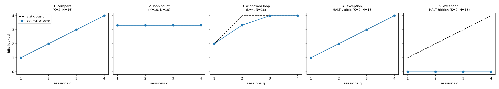

# Static trace-capacity accounting for typed agent plans

A bits-per-session ledger for planner-style agent defenses (CaMeL, FIDES), with an exact optimal adaptive-attacker experiment.
The core inequality is classical quantitative information flow (Smith; Koepf and Basin). The contribution here is applying it as a static,
type-derived ledger for planner agents and measuring the utility cost. Scope: deterministic plans and stub extractors.

**Paper:** [`paper/Static_Trace_Capacity_Accounting_Note.pdf`](paper/Static_Trace_Capacity_Accounting_Note.pdf) (LaTeX source alongside). Draft v1, not peer reviewed.

## Quick start

Tested on Python 3.12; should work on 3.9 or later.

    pip install -r requirements.txt
    pytest -q tests          # 10 tests: Theorem 1 on 3000 random programs, Theorems 2/3, validator checks
    python experiments.py    # results.csv, leakage_vs_bound.png
    python utility.py        # utility_curve.csv, utility_curve.png
    python heavy_tail.py     # heavy_tail_results.csv, heavy_tail.png (fixed seed 2026)

Or:

uv sync
uv run pytest -q tests
uv run python experiments.py
uv run python utility.py
uv run python heavy_tail.py

## Layout

| File | Purpose |
|---|---|
| `core.py` | Typed-plan IR, accountant `K(P)`, annotation validator, exact optimal adaptive attacker (DP) |
| `tests/test_soundness.py` | Property tests and hand-worked examples |
| `experiments.py` | Five channels: optimal attacker vs static bound |
| `utility.py` | Oracle utility under an imposed 0/1/3-bit policy (FIDES task taxonomy) |
| `heavy_tail.py` | Beta-mixture model of attack success; tail-exponent estimation |
| `paper/` | PDF and LaTeX source of the note |

## Headline results (toy scale, N <= 16 secrets)

- Channels with a binary comparison or a visible exception meet the bound exactly. A windowed loop shows slack: 3.32 bits actual vs a 4-bit bound at q = 2.
- Under an imposed 0/1/3-bit policy, oracle utility over 97 AgentDojo user tasks is 26.8%, 79.4%, and 100%. Worst-case sessions to recover a 40-bit secret: unbounded, 40, 14.
- Two defenses with the same 2% single-attempt success rate reach 75.4% vs 38.8% at 100 attempts. The tail exponent, not the pooled rate, predicts growth.

## Limitations

- Deterministic plans, stub extractors, one persistent secret, uniform prior, toy-scale domains.
- Annotations (`secret_dep`, `domain`, `n_max`) are trusted; the validator tests them on small domains only.
- No mutable cross-session agent memory. The 0/1/3-bit costs are an imposed policy, and utility is an oracle upper bound.
- `heavy_tail.py` models independent sampling attacks only; optimizing attackers can do better.
- Nothing here is a claim about CaMeL or FIDES as shipped.

## Citing

See `CITATION.cff` (GitHub shows a "Cite this repository" button).
